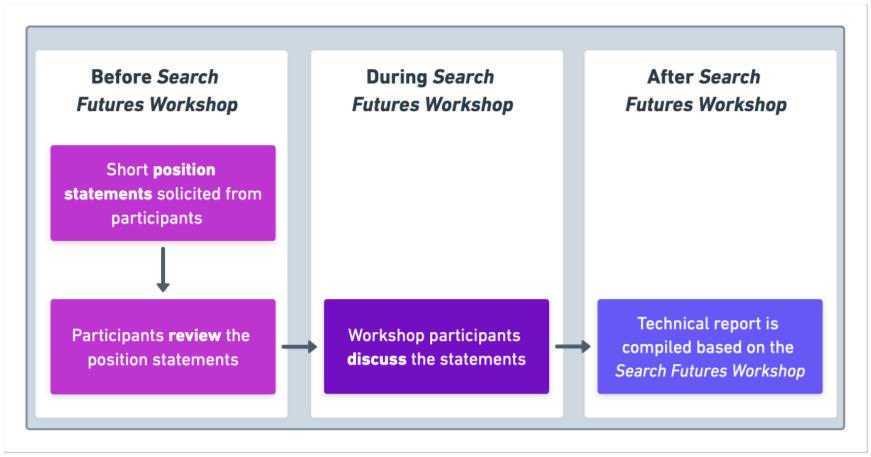
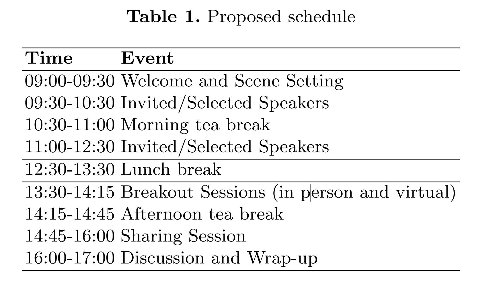

# The Search Futures Workshop

***Leif Azzopardi¹, Charlie Clarke², Paul Kantor³, Bhaskar Mitra⁴, Johanne Trippas⁵, and Zhaochun Ren⁶***

¹ University of Strathclyde,UK. ² University of Waterloo, Canada.  ³ Rutgers University, USA. ⁴ Microsoft Research, Canada.  ⁵ RMIT University, Australia. ⁶ Leiden University, Netherlands.

**Abstract**. The field and community of Information Retrieval (IR) are changing and evolving in response to the latest developments and ad- vances in Artificial Intelligence (AI) and research culture. As the field and community re-oriented and re-consider its positioning within com- puting and information sciences more generally – it is timely to gather and discuss more seriously our field’s vision for the future – the chal- lenges and threats that the community and field faces – along with the bold new research questions and problems that are arising and emerging as we re-imagine search. This workshop aims to provide a forum for the IR community to voice and discuss their concerns and pitch proposals for building and strengthening the field and community.

**Keywords**: Future of search · Information retrieval · Artificial intelli- gence.

## 1  Introduction and Motivation

The field of Information Retrieval (IR) is undergoing a profound transformation, spurred by the continual evolution and breakthroughs in the realm of artificial intelligence and the broader changing research landscape. This reformation pe- riod finds our field and community in a state of introspection, as we contemplate and reevaluate our role and significance within the broader context of computing and information sciences. This juncture in our journey serves as an opportune moment to convene and engage in a deep and purposeful dialogue concerning the future trajectory of our field. We must collectively confront the myriad chal- lenges and potential threats that loom on the horizon, all while embracing the newfound opportunities and bold research inquiries that emerge as we embark on a re-imagined quest for the next generation “memex machine” [5].

The purpose of this workshop is to serve as a dedicated platform for the IR community to candidly express and deliberate upon the issues that weigh on our collective conscience. It is a forum where we can voice our concerns and brainstorm and present innovative proposals aimed at fortifying and enriching our field and the community that sustains it.

As we stand at the intersection of technological innovation and scholarly in- trospection, we find ourselves confronted with a multitude of pertinent questions. How can we harness the power of AI to enhance the effectiveness of information retrieval? What safeguards do we need to put in place to protect the integrity and privacy of the data we handle? How can we ensure that the fruits of our research are accessible and beneficial to all members of society? These are just a few examples of the pressing issues we face as we navigate this dynamic, new IR landscape.

In our pursuit of “search futures”, this workshop aims to provide the first

of several forums, for the community to discuss and contribute to our collective agenda for the research directions and field. We hope that together, we can chart

a course that not only safeguards IR’s continued relevance and vitality but also propels it into uncharted territories of discovery and exploration.

## 2  Workshop Goals and Objectives

The Search Futures Workshop aims to provide a much-needed forum for the IR community to discuss the emerging challenges to the field and community. Our goals are to:

- Kick off a series of workshops which generate an open conversation about possible Search Futures,
- Provide a forum at ECIR to discuss the pressing and emerging issues our field faces, and,
- Produce a report detailing the initial outcomes of this first workshop on Search Futures.
- Continue this ambitious series for Search Future workshops at subsequent IR conferences to include further and wider perspectives.

### 2\.1 Topics of Interest

Short position statements from participants will be solicited through direct in- vitation and an open call to the ECIR community. We will select a diverse and representative subset from the position statements submitted to present their position/perspective during the workshop. We would like to attract a broad range of positions about the future of search. Topics of interest may include, but are not limited to:

- IR and related fields
  - What the field of IR is tackling, should be tackling, is not tackling,... and is such research is even important?
  - What is IR any more in the context of recommender systems, NLP, ML, AI, etc.?
  - What are the core questions we are answering? Are they worth answer- ing?
- IR in the age of generative AI
  - How generative AI is changing the nature and relevance of search?
  - How can we distinguish originals from derivatives, real from fake, etc.?
  - When everything can be generated, what is a document? What are we retrieving?
- IR and community
  - How can we build and grow the IR community?
  - How can we support newer community members?
  - Is a bigger, more diverse community better? How can we evaluate our- selves?
  - What are our conferences turning into?
  - Where are all the core IR papers?
  - What should the scope and remit of IR conferences and journals be?
- IR and the business
  - What are the new economics of IR?
  - How does conversational search change current business models?
  - How do traditional media and content-based models fit into the emerging landscape?
  - Can IR further optimize workplace productivity?
- IR ethics, trust and responsibility
  - What is the duty / responsible of an IR system?
  - If I want to see more, should the system give it to me?
  - How can we trust IR systems if they make up everything?
  - How environmentally responsible are the IR systems we are making?
- IR and people, users, consumers, creators,..
  - Are creators still needed in the age of generative AI?
  - Is IR helping overcome the digital divide?
  - Is IR addressing the disparity in information access, especially in marginal- ized communities?
  - Should IR systems curate information for users to avoid information overload?
  - What is the future of results presentation?
  - How can we develop IR systems integrated with IoT?
  - How do information systems influence user’s emotions?

## 3  Workshop Format and Structure

We are proposing a full-day workshop. We will send out a call for speakers, rather than a call for papers. Participants will be asked to submit an abstract- only position statement outlining what issue/aspect/challenge they would like

to put forward and potentially provide a talk during the ECIR workshop. These statements will also help anticipate and design our breakout sessions.7 The short

statements will help make the process lightweight and accessible, attracting a wide variety of speakers supporting ECIR’s mission on diversity and inclusion.

------

<b>⁷ Submissions will be handled via EasyChair, where we will ask for abstract-only position statements.</b>

------

The Search Futures Workshop organisers will curate the position statements and make them available to the workshop attendees before the workshop, see Fig- ure 1. This process will enable all participants to review the submitted position statements.

​	
<b>Fig.1.Search</b> Futures Workshop Overview.
																			

During the workshop, the first part of the day will be dedicated to invited and selected speakers setting the scene based on the submitted position statements. Then, after lunch, we will have several breakout sessions where organizers will lead the groups to discuss the issues that surfaced during the scene setting. We will also include a virtual breakout session that will be run in parallel to include attendees who can not attend in person. During the breakout sessions, we will use Google Documents to take notes and write up the discussions collaboratively. After the breakout sessions, we plan to reconvene to share the breakout findings and finish with a panel-based discussion.

### 3.1 Proposed Schedule

The proposed schedule is below:

### 3.2 Workshop Outputs and Follow-ups

At first pass, stemming from this workshop, we will compile a SIGIR Forum Article to disseminate the workshop findings to the broader community. We will employ a similar collaborative approach to writing up the article as we have used in previous workshops (such as such as FACTS-IR at SIGIR 2019 [8], Future Conversations Workshop at CHIIR 2021 [9], and the ECR’s Roundtable for Information Access Research (ECRs4IR 2022) [10]), where participants were encouraged to contribute and co-author the submission.

​	

We see this workshop as part of a series of workshops on Search Futures – where ideally, we would like to hold it at ECIR (Europe), SIGIR (USA) and SIGIR AP (Asia) – to gather a wide and diverse range of opinions and perspec- tives on the future of search. The end goal is to write up a collective perspectives paper presenting our community views to the broader research community (for instance, via a Communications of the ACM or Science Article) – presenting something like the “unsolved list of IR problems ” on Wikipedia like the linguis- tics community has done8.

### 3.3 Intended Audience

ECIR is the premier venue for information retrieval in Europe and, as such, serves as the most relevant and accessible European forum that will bring together core IR researchers to discuss the future of search and research. We aim to attract core long-standing and new members of the information retrieval community for a lively discussion – as well as solicit opinions and perspectives from outwith the community and those who have been reaching out to other communities. There are no requirements or restrictions on attendance – though the subset of speakers selected will try to encompass a diverse range of perspectives. We expect to attract 30-50 participants interested in helping shape and propose the future of search.

## 4  Organisers

To run the workshop, we have six organizers, five of whom can confirm that they will attend ECIR in person. Our organization team aims to bring together the IR Oldies with the up-and-coming stars in our field from industry, academia, and around the globe.

------

<b>⁸ See https://en.wikipedia.org/wiki/List_of_unsolved_problems_in\_linguistics</b>

------

**Leif Azzopardi** is an Associate Professor in the Department of Computer and Information Sciences at the University of Strathclyde, Glasgow. His research fo- cuses on building models and metrics for interactive information retrieval with a focus on model users in the lab and in the wild. Recently, he has been work- ing with Microsoft Search and AI on (conversational) search. He has organized numerous IR events e.g. PC Chair of FDIA (2008-2015), PC Chair of IIiX 2014, PC Chair SimInt 2010 @ ACM SIGIR, and PC Chair of ICTIR 2008, General Chair of ACM CHIIR 2019 and PC Chair of ECIR 2019.

**Charlie Clarke** is a Professor in the School of Computer Science at the Uni- versity of Waterloo, Canada. His research focuses on data intensive tasks and efficiency, including search, ranking, question answering, and other problems in- volving human language data at scale. In addition to his academic experience, he has worked on search engine technology for both Microsoft Bing and Facebook Search. He has previously co-organized workshops at ECIR (2014, 2011), SIGIR (2016, 2015, 2013, 2012), WSDM (2012) and CHIIR (2023, 2020).

**Paul Kantor** is Distinguished Professor (Emeritus) of Information Science at Rutgers, and an Honorary Associate in the Department of Industrial and Sys- tems Engineering at the University of Wisconsin Madison. His work has primarily focused on evaluation of Information (Retrieval) Systems, with an emphasis on relating that evaluation to the specific needs of the system’s user at the moment. He also developed early recommendation systems called ANLI (pre WWW) and AntWorld, which have vanished without a trace. That research has been sup- ported by the US NSF, Department of Education, DARPA, and NATO.

**Bhaskar Mitra** is a Principal Researcher at Microsoft Research based in Mon- treal, Canada. His research focuses on AI-mediated information and knowledge access and questions of fairness and ethics in the context of these socio-technical systems. Before joining Microsoft Research, he worked on search technologies at Bing for 15+ years. He is serving as the ACM SIGIR Community Relations Coordinator and on the NIST TREC program committee. He has co-organized several workshops (Neu-IR @ SIGIR 2016-2017 and HIPstIR 2019), shared eval- uation tasks (TREC Deep Learning Track 2019-2023, TREC Tip-of-the-Tongue Track 2023, and MS MARCO ranking leader boards), and tutorials (WSDM 2017-2018, SIGIR 2017, and ECIR 2018).

**Johanne Trippas** is a Vice-Chancellor’s Research Fellow at RMIT Univer- sity, specializing in intelligent systems, focusing on digital assistants and con- versational information seeking. Her research aims to enhance information ac- cessibility through conversational systems, interactive information retrieval, and human-computer interaction. Additionally, Johanne is currently part of the NIST TREC program committee and is an ACM CHIIR steering committee member. She serves as vice-chair of the SIGIR Artifact Evaluation Committee, tutorial chair for ECIR’24, general chair of the ACM CUI’25, and ACM SIGIR-AP’23 proceedings chair. She has organized workshops (CHIIR’20–22), a TREC Track (CAsT’22), and tutorials (CHIIR’21, SIGIR’22, and WebConf’23).

**Zhaochun Ren** is an Associate Professor at Leiden University. His research interests focus on joint research problems in information retrieval and natural language processing, with an emphasis on conversational information seeking, question-answering, and recommender systems. He aims to develop intelligent systems that can address complex user requests and solve core challenges in both information retrieval and natural language processing towards that goal. In addition to his academic experience, he worked on e-commerce search and recommendation at JD.com for 2+ years. He has co-organized workshops at SIGIR (2020) and WSDM (2019, 2020).

### 4.1 Invited / Selected Speakers and Maximising Diversity

To select the speakers for the workshop, we will have an open call for speakers through the standard channels (i.e., Slack, SIGIR and other mailing lists), as well as personally inviting a diverse range of participants who are core to the community, have left the community, or are new to the community. The workshop organisers will act as the programme committee to curate and select speakers. We will aim to select between 6–12 speakers to pitch their ideas for the future of search. We hope to gather a mixture of old, new, fringe, rebellious, and passionate researchers and practitioners from a range of backgrounds.

During the introduction to the workshop, we will summarise the views cap- tured within the position statements to allow participants to vote on and discuss other topics not represented by our selected speakers. These position statements will also be summarised in the workshop report so that others can continue the conversation – if not fully discussed here.

### 4.2 Related Workshops and Increasing Inclusivity

Previous strategic workshops in the information retrieval community have so- licited community members’ input to develop forward-looking research visions for the field. These workshops have either focused on specific sub-areas, such as the Dagstuhl seminars on conversational search [2] and information access exper- imentation [3], or reflected more broadly on the whole field, such as the Strategic Workshops on Information Retrieval in Lorne (SWIRL) [7,1,4] and—its more “alternative” rendition—the HIPstIR workshop [6]. Unlike these previous work- shops, where attendance was based on invitation, the Search Futures Workshop will have an open call for position statements from members of the information retrieval community. We expect that being collocated with a prominent confer- ence in the field will encourage more diverse participation from the community, including across different levels of seniority, academic and industry affiliations, and areas of research interests. We intend to follow up this proposed workshop with subsequent instances hosted at other IR conferences to solicit perspective from a wider audience and give a platform to a broader range of voices from the field.

## References

1. Allan, J., Croft, B., Moffat, A., Sanderson, M.: Frontiers, challenges, and opportu- nities for information retrieval: Report from swirl 2012 the second strategic work- shop on information retrieval in lorne. In: Acm sigir forum. vol. 46, pp. 2–32. ACM New York, NY, USA (2012)
1. Anand, A., Cavedon, L., Hagen, M., Joho, H., Sanderson, M., Stein, B.: Dagstuhl seminar 19461 on conversational search: seminar goals and working group out- comes. In: ACM SIGIR Forum. vol. 54, pp. 1–11. ACM New York, NY, USA (2021)
1. Bauer, C., Carterette, B., Ferro, N., Fuhr, N.: Report on the dagstuhl seminar on frontiers of information access experimentation for research and education. In: SIGIR Forum (ACM Special Interest Group on Information Retrieval). vol. 57,

   16. 7. Association for Computing Machinery (ACM) (2023)
1. Culpepper, J.S., Diaz, F., Smucker, M.D.: Research frontiers in information re- trieval: Report from the third strategic workshop on information retrieval in lorne (swirl 2018). In: ACM SIGIR Forum. vol. 52, pp. 34–90. ACM New York, NY, USA (2018)
1. Davies, S.: Still building the memex. Commun. ACM 54(2), 80–88 (feb 2011). https://doi.org/10.1145/1897816.1897840, https://doi.org/10.1145/1897816. 1897840
1. Dietz, L., Mitra, B., Pickens, J., Anber, H., Avula, S., Biega, A., Boteanu, A., Chatterjee, S., Dalton, J., Dietz, L., et al.: Report on the first hipstir workshop on the future of information retrieval. In: ACM Sigir forum. vol. 53, pp. 62–75. ACM New York, NY, USA (2021)
1. Moffat, A., Zobel, J., Hawking, D.: Recommended reading for ir research students. In: ACM SIGIR Forum. vol. 39, pp. 3–14. ACM New York, NY, USA (2005)
1. Olteanu, A., Garcia-Gathright, J., de Rijke, M., Ekstrand, M.D., Roegiest, A., Li- pani, A., Beutel, A., Olteanu, A., Lucic, A., Stoica, A.A., Das, A., Biega, A., Voorn, B., Hauff, C., Spina, D., Lewis, D., Oard, D.W., Yilmaz, E., Hasibi, F., Kazai, G., McDonald, G., Haned, H., Ounis, I., van der Linden, I., Garcia-Gathright, J., Baan, J., Lau, K.N., Balog, K., de Rijke, M., Sayed, M., Panteli, M., Sanderson, M., Lease, M., Ekstrand, M.D., Lahoti, P., Kamishima, T.: FACTS-IR: Fairness, accountability, confidentiality, transparency, and safety in information retrieval. SIGIR Forum 53(2), 20–43 (Mar 2021)
1. Spina, D., Trippas, J.R., Thomas, P., Joho, H., Bystr¨om, K., Clark, L., Craswell, N., Czerwinski, M., Elsweiler, D., Frummet, A., et al.: Report on the future con- versations workshop at CHIIR 2021. In: ACM SIGIR Forum. vol. 55, pp. 1–22. ACM New York, NY, USA (2021)
1. Trippas, J., Maxwel, D., Alqatan, A., Boom, M., Chavula, C., Crescenzi, A., Ib´anez, L.D., Meyer, S., Ortloff, A.M., Palani, S., et al.: Report on the 1st Early Career Re- searchers’ Roundtable for Information Access Research (ECRs4IR 2022) at CHIIR 2022. In: ACM SIGIR Forum. vol. 56, pp. 1–10. ACM New York, NY, USA (2023)
